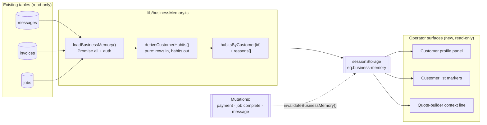
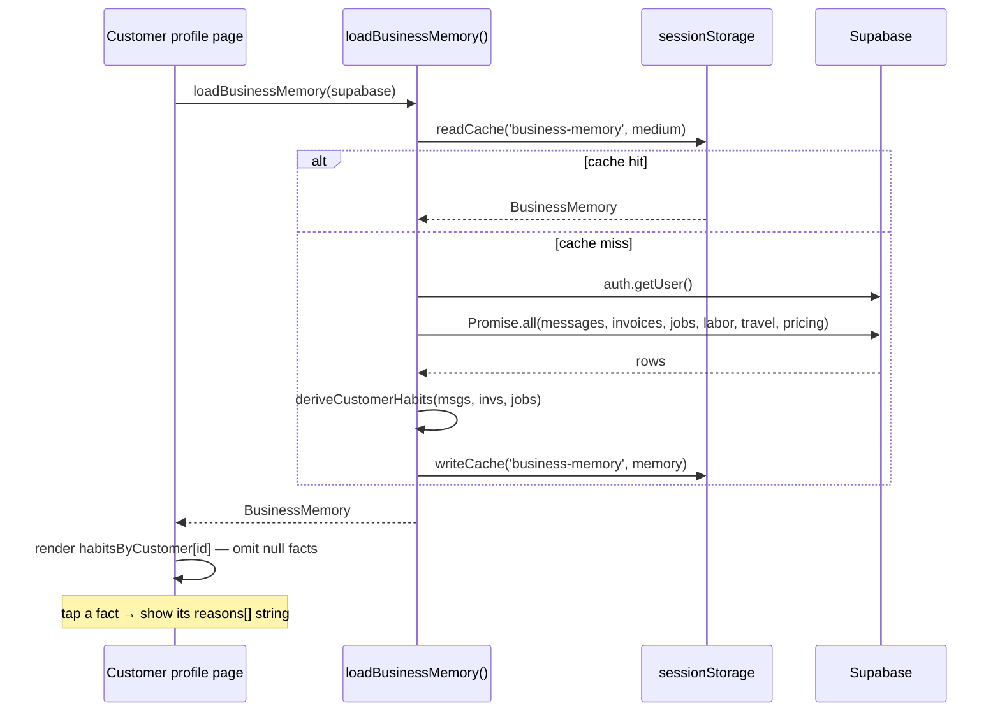

# Implementation Spec — Customer Memory Surfaces

**Status: IMPLEMENTATION-READY SPEC. No code written. Opens no lane. Changes no
roadmap.** Subordinate to `PRODUCT-VISION.md` — §9 (*Remember the customer's
habits*), §4 (*calm/automatic*), §10 (*structural explainability*, *AI never
prices*). Verified against `origin/main` (`22ec54d`).

**The one-line case:** `src/lib/businessMemory.ts` is a complete, cached, pure
habit-derivation engine — and it has **zero UI consumers**. This spec surfaces it.
It adds **no storage, no learner, no migration**; it reads rows the app already
holds and displays what the engine already derives. Every phase here is additive
and read-only except one deliberately-gated composer default (see §Out of scope).

---

## 1. User experience

The product promise is "EdgeQuote remembers everything, and never asks the same
thing twice." Today the operator re-learns each customer from scratch. After this:

- **On the customer's profile, a quiet "What we remember" panel.** Only facts the
  engine actually derived appear — each is a plain sentence, not a metric wall:
  *"Replies by text (fast, ~20 min)," "Pays in ~3 days," "Usually books Mowing,"
  "Visits usually start ~08:00," "Repeat customer."* An unknown fact is **omitted,
  never shown as 0 or "—"** (the engine already returns `null` below its sample
  thresholds; the UI honours that).
- **Every fact carries its "why."** Tapping a fact reveals the engine's own
  `reasons[]` string (e.g. *"Replies by text (4×)"*). Explanation is part of the
  data, not a debug view (§10).
- **Context where the decision is made, not just on a profile page.** On the quote
  builder, a one-line, **read-only** context note — *"Usually books Mowing · visits
  ~8am"* — so the operator prices and schedules with the customer's pattern in view.
  On the customer list, a small **repeat** / **pays-fast** / **pays-slow** marker.
- **Strictly facts, never prose or price.** These are engine-derived values with
  reasons — no LLM writes them, and nothing here pre-fills or nudges a price
  (§10 boundary).

## 2. Affected screens

| Screen | File | Change | Gated? |
|---|---|---|---|
| Customer profile | `src/app/dashboard/customers/[id]/page.tsx` | Add the "What we remember" panel (primary consumer of `habitsByCustomer[id]`) | No |
| Customer list | `src/app/dashboard/customers/page.tsx` | Small repeat / pays-fast-or-slow marker per row | No |
| Quote builder | `src/app/dashboard/quotes/new/page.tsx`, `src/app/dashboard/quotes/[id]/*` (`QuoteBuilder`) | Read-only context line (usual service, typical start) — **must not touch price** | No |
| Dashboard | the Morning Briefing surface | Optional: memory-aware note on today's customers | No |
| Message composer | `src/components/comms/SendMessageDialog.tsx` | Default the channel to `preferredChannel` | **Yes — messaging freeze** |

## 3. Existing engines reused

- **`src/lib/businessMemory.ts`** — the whole feature:
  - `loadBusinessMemory(supabase, { force? }) → BusinessMemory | null` — cached
    (`CACHE_TTL.medium`), fault-tolerant, one call. Returns `habitsByCustomer:
    Record<customerId, CustomerHabits>`.
  - `CustomerHabits` fields to render: `preferredChannel`, `medianResponseMin`,
    `medianDaysToPay`, `paymentsOnRecord`, `favoriteServices[]`, `typicalStartTime`,
    `completedJobs`, `cancelledJobs`, `repeatCustomer`, `lastCompletedAt`, `reasons[]`.
  - `collectionStats()` / `collectionDays()` — if a surface needs days-to-pay
    directly (same definition the BI headline uses, so they can never disagree).
  - `invalidateBusinessMemory()` — call after a mutation that changes a habit
    input (payment recorded, job completed, message sent) so the cache refreshes.
- **`src/lib/labor.ts`** `serviceKey` / `serviceLabel` — already used inside the
  engine; the UI shows `favoriteServices[].label`. One service vocabulary.
- **`src/lib/clientCache.ts`** — caching is already built into the loader; the UI
  just calls `loadBusinessMemory`.

No new engine, no new learner, no change to how any habit is derived.

## 4. Database objects reused

**Read-only. No new table, no new column, no migration.** `loadBusinessMemory`
already queries exactly these:

- `messages` — `customer_id, direction, channel, created_at` (preferred channel,
  response time).
- `invoices` — `customer_id, issued_date, paid_at` (days-to-pay).
- `jobs` — `customer_id, service_type, status, start_time, scheduled_date,
  completed_at` (favourite services, typical start, cancellations, repeat).

## 5. Implementation order

1. **Customer-profile panel** — highest value, single-customer read of
   `habitsByCustomer[id]`. Call `loadBusinessMemory` once on the page; render each
   non-null fact with its `reasons[]` on tap; omit undrawn facts. Ships alone.
2. **Customer-list markers** — reuse the same cached `BusinessMemory`; render
   repeat / pays-fast-or-slow per row.
3. **Quote-builder context line** — read-only usual-service + typical-start; wired
   so it can never influence a number.
4. **Dashboard memory note** — optional, once 1–3 have proven the surface.
5. **(Gated) composer channel default** — only after the owner opens the messaging
   lane; defaults `SendMessageDialog` to `preferredChannel`, still fully overridable.

## 6. Out of scope

- **Any new storage.** Habits are derived on read; never persist a
  `customer_habits` table or column. If performance ever demands it, that is a
  separate proposal, not this one.
- **Changing derivation** (thresholds, medians, caps) — that is the engine's single
  responsibility; this spec only *renders* what it returns.
- **Collections-timing / governor-timed reminders** — a **separate** roadmap item.
  This spec displays `medianDaysToPay` as a fact; it does **not** change when any
  reminder fires or touch `lib/comms/governor.ts`.
- **AI-written summaries** — habits are facts with `reasons[]`; no LLM narration.
- **Any price pre-fill or price influence** (§10 AI-never-prices boundary).
- **The composer channel default** — deferred and gated (messaging freeze); listed
  in §2/§5 only to fix its place, not to build it now.

## 7. Rollout plan

- **Risk: minimal.** Additive, read-only, no migration → nothing to roll back at
  the data layer. Each surface is independently shippable; no flag strictly
  required, though a simple UI flag lets the profile panel go first.
- **Progressive render.** `loadBusinessMemory` is cached and best-effort; on a cold
  cache a surface may show fewer facts for a moment — render what's present, fill in
  on load, and never block the page on it.
- **Reality check before display.** Because the engine reads live rows, sanity-check
  a handful of real customers' derived habits against what the owner knows to be
  true (preferred channel, days-to-pay) before enabling widely.
- **Honesty guard.** Recommend a small pure-function assertion harness over
  `deriveCustomerHabits` (unknown → `null`; a single data point never yields a
  median; caps hold) so a future refactor can't quietly start fabricating. This is
  a test artifact, not a roadmap item.
- **Sequence:** profile panel → list markers → quote context → (later, gated)
  composer default.

---

## 8. Architecture audit (verified against `origin/main` @ `66e0181`)

Re-verified before enriching this spec — every claim holds; two operational notes
are load-bearing enough to call out.

| Claim | Verified | Note |
|---|---|---|
| The engine exists and is complete | ✅ `src/lib/businessMemory.ts` | `loadBusinessMemory`, `deriveCustomerHabits`, `collectionStats`, `invalidateBusinessMemory` all present |
| Zero UI consumers today | ✅ | Only `businessIntelligence.ts` imports it, and only `collectionStats` (aggregate); `habitsByCustomer` is unconsumed |
| Read-only, no new storage | ✅ | Loader queries `messages`/`invoices`/`jobs` only; no writes, no new table |
| Cached | ✅ `src/lib/clientCache.ts` | `sessionStorage` key **`eq:business-memory`**, `CACHE_TTL.medium` |
| Explainable | ✅ | `CustomerHabits.reasons[]` is populated in the engine — the UI renders it, never invents it |

**Two operational truths the implementer must honour:**

1. **Cache invalidation is manual.** `invalidateBusinessMemory()` clears
   `sessionStorage['eq:business-memory']`. A displayed habit will go stale until the
   cache TTL expires **unless** you call it after a mutation that changes a habit
   input — payment recorded (`medianDaysToPay`), job completed (`favoriteServices`,
   `typicalStartTime`, `repeatCustomer`), message sent/received (`preferredChannel`,
   `medianResponseMin`). Wire the invalidation at those existing mutation sites.
2. **The loader is tenant-wide and bounded.** It fetches up to 2000 messages / 1000
   paid invoices / 2000 jobs for the whole business in one cached call — so a
   surface reads `habitsByCustomer[id]` from memory, it does **not** query per
   customer. Deep-history tenants past those caps lose the oldest rows from the
   derivation; acceptable for habit medians, but note it, and do not "fix" it with a
   second per-customer query (that would fork the engine).

## 9. Sequence & data-flow diagrams

**Data flow — one engine composes existing tables into per-customer habits, cached once, read by many surfaces:**

**Sequence — a customer profile renders the memory panel (cache-first):**

## 10. Implementation checklists

**Phase 1 — Customer-profile panel (un-gated)**
- [ ] Call `loadBusinessMemory(supabase)` once on `customers/[id]` load; read `habitsByCustomer[customerId]`.
- [ ] Render only non-null facts (preferred channel, days-to-pay, favourite service, typical start, repeat, response time); **omit** unknowns — never render 0 or "—".
- [ ] Each fact tappable → its matching `reasons[]` entry (tooltip/expander).
- [ ] Call `invalidateBusinessMemory()` at the existing payment-record, job-complete, and message-send mutation sites.
- [ ] No price, no LLM text, no new column.

**Phase 2 — Customer-list markers (un-gated)**
- [ ] Reuse the same cached `BusinessMemory`; render repeat / pays-fast / pays-slow per row from `habitsByCustomer[id]`.
- [ ] Degrade silently for customers with no derived habits.

**Phase 3 — Quote-builder context line (un-gated)**
- [ ] Read-only line: usual service + typical start, from `habitsByCustomer[id]`.
- [ ] Wire so it is structurally incapable of touching a price field (§10 boundary).

**Phase 4 — Composer channel default (GATED: messaging lane)**
- [ ] Only after the owner opens the messaging lane: default `SendMessageDialog` channel to `preferredChannel`, fully overridable.

**Cross-cutting**
- [ ] Add a pure-function assertion harness over `deriveCustomerHabits` (unknown → null; one data point ≠ a median; caps hold).
- [ ] Sanity-check a few real customers' derived habits vs. owner knowledge before wide enablement.
