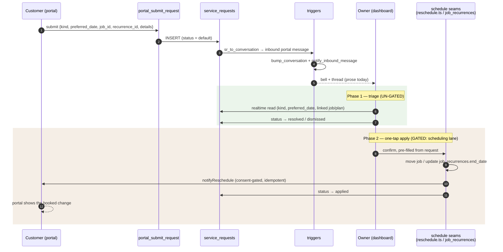
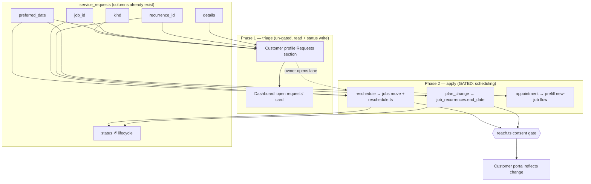

# Implementation Spec — Structured Customer Requests (owner side)

**Status: IMPLEMENTATION-READY SPEC. No code written. Changes no roadmap.**
Subordinate to `PRODUCT-VISION.md` — §9 (*the customer makes requests, never
mutates operator records; the owner confirms*), §4 (*remove a click*), one-engine
principle. Verified against `origin/main` (`22ec54d`).

**⚠️ Freeze gate, declared up front.** The customer **write** side already shipped
(`RUN-2026-07-15-portal-self-service.sql`). This spec is the missing owner
**read/act** side, in two phases:

- **Phase 1 (triage) is un-gated** — additive read of the structured columns plus a
  `status` write on `service_requests` (a column that already exists).
- **Phase 2 (one-tap apply) is GATED on the owner opening the scheduling lane**
  (`scheduling-final-polish` @ `1d4ef66`), because the apply-write routes through
  the **frozen** schedule mutation seams (`jobs` move + `job_recurrences` update in
  `schedule/page.tsx`, and `lib/reschedule.ts`). **This spec opens no lane;** it
  declares the gate and is built to that boundary.

**The one-line case:** customers can already ask — with structure (`kind`,
`preferred_date`, `job_id`, `recurrence_id`, `details`) — to book, reschedule,
skip, pause, or cancel. The owner currently sees only the **prose** and re-keys it
into the calendar by hand. This closes the loop the customer half already opened.

---

## 1. User experience

- **Requests become actionable, not just readable.** Each structured request shows
  its **kind** (Appointment / Reschedule / Plan change), the customer, the parsed
  intent (the `preferred_date`, the specific job or plan it points at), and the
  customer's own words.
- **Phase 1 — triage (un-gated).** The owner sees the request in a dedicated place,
  jumps straight to the linked job/customer, replies through the existing Messages
  thread, and marks it **resolved** or **dismissed** (a `status` transition). No
  calendar change yet — but the request stops being a message that scrolls away.
- **Phase 2 — one-tap apply (gated).** From the request, a single confirmed action:
  *"Move to {preferred_date}"* for a reschedule; *"Skip next visit" / "Pause plan"
  / "Cancel plan"* for a plan change; *"Book {preferred_date}"* (pre-fills the new
  job, never auto-books) for an appointment. The action is **pre-filled from the
  request** — the owner confirms instead of re-typing.
- **The loop closes honestly.** The portal already promises the customer *"nothing
  changes until we confirm."* The owner's apply **is** that confirmation: on apply,
  the request `status` flips and the customer sees the booked change on their portal
  — the exact round-trip the portal self-service was built to make true.

## 2. Affected screens

| Screen | File | Change | Gated? |
|---|---|---|---|
| Customer profile | `src/app/dashboard/customers/[id]/page.tsx` | Per-customer "Requests" section (this page already subscribes via `useRealtimeRefresh('service_requests', …)` and reloads) | No (Phase 1) |
| Requests inbox | a **new** dashboard card / surface (e.g. "N open requests") | Owner's triage entry point across customers | No (Phase 1) |
| Reschedule apply | `src/components/dispatch/RescheduleDialog.tsx` (reused) | Pre-fill from the request; confirm → move + notify | **Yes — scheduling** |
| Plan-change apply | schedule recurrence mutation in `src/app/dashboard/schedule/page.tsx` | Skip / pause / cancel via the existing `job_recurrences` update | **Yes — scheduling** |

> Prefer a **new** requests surface (dashboard card or a section on the customer
> profile) over editing the **frozen** Messages page/composer. The request already
> threads into Messages as prose; this spec adds an actionable view, it does not
> modify the messaging composer.

## 3. Existing engines reused

- **Customer write side (already live):** `portal_submit_request` (writes the
  structured columns), the `sr_to_conversation` trigger (threads it to the owner),
  `notify_inbound_message` (raises the bell). Untouched — this is the read/act half.
- **Phase 2 apply (all existing, all frozen-lane):**
  - `src/lib/reschedule.ts` — `notifyReschedule` / `notifyRescheduleBatch`: the
    opt-in-gated, logged, idempotent customer-notify seam.
  - `src/app/dashboard/schedule/page.tsx` — the existing job-move and
    `job_recurrences.update({ … end_date })` mutation seams (the apply-write routes
    **through** these; it introduces **no** second scheduling path).
  - `src/lib/recurrence.ts` — `shiftDate`, `dayDelta`, `jobsInScope`,
    `RecurrenceScope` for scope math; `src/lib/jobStatus.ts` for visit state.
  - `src/lib/comms/reach.ts` — governs any customer notification (consent). Reused.

## 4. Database objects reused

**No schema change.** Every column already exists:

- `service_requests` — `customer_id, message, status, kind, preferred_date,
  job_id, recurrence_id, details`. `kind` is constrained to
  `('service','appointment','reschedule','plan_change')`. **Reuse `status`** for
  the owner lifecycle: confirm its current default/vocabulary against the live
  check/column before writing, and transition to a resolved/dismissed value on
  action (the website-lead/booking inserts already set `status`, so the column is
  the established lifecycle field).
- `jobs` — the reschedule target (moved via the existing schedule mutation).
- `job_recurrences` — `end_date` etc. for pause/cancel (written via the existing
  schedule seam).
- `conversations` / `messages` — the request already threads here; replies use the
  existing path.

## 5. Implementation order

1. **Phase 1a — per-customer Requests section** on `customers/[id]`: read the
   structured columns, render `kind` + `preferred_date` + the linked job/plan +
   prose; link to the target; reply via existing Messages. (Un-gated; the page
   already subscribes.)
2. **Phase 1b — "Open requests" dashboard card**: count + list as the triage entry
   point; `status` → resolved/dismissed. (Un-gated.)
3. **— GATE: owner opens the scheduling lane —**
4. **Phase 2a — one-tap reschedule**: confirm dialog pre-filled from the request →
   existing owner reschedule move + `lib/reschedule` notify → flip `status` → portal
   reflects the booked date.
5. **Phase 2b — one-tap skip-next / pause / cancel** (plan_change): via the existing
   `job_recurrences` mutation + notify seam.
6. **Phase 2c — appointment**: pre-fill the new-job/schedule flow from
   `preferred_date`. Never auto-book.

## 6. Out of scope

- **The customer/portal write side** — shipped and frozen; unchanged.
- **The frozen Messages composer/page** — this adds an actionable view elsewhere,
  it does not edit the composer.
- **Any new scheduling engine.** Phase 2 routes through the **existing** schedule
  mutation + `lib/reschedule`; introducing a second "move a job" path violates the
  one-engine principle and is explicitly forbidden here.
- **Auto-applying a request without owner confirmation** — breaks §9 and the
  portal's own "nothing changes until we confirm" promise.
- **New request kinds or portal changes** (customer side is done).
- **Bulk request handling / SLA automation** — future, not this spec.

## 7. Rollout plan

- **Phase 1 first, and it stands alone.** Additive read + a `status` write on an
  existing column → low risk, immediate triage value, and it validates the
  structured data against real inbound requests before any apply logic exists.
- **Phase 2 only after the lane is open.** Build behind a flag. **Idempotency
  matters:** the surface re-subscribes in realtime, so guard every apply on the
  request `status` so an applied request can never be applied twice.
- **Verify the whole loop on a real portal token** — customer submits a structured
  request → owner applies → the job/plan actually moves → the customer is notified
  (consent-gated) → the portal shows the booked change → the request reads resolved.
  This mirrors exactly how the portal self-service was verified (RPCs exercised
  against real tokens; writes proven end-to-end).
- **Guardian check on Phase 2:** confirm no second scheduling or notify path was
  introduced — every apply must resolve to the existing seams.

---

## 8. Architecture audit (verified against `origin/main` @ `66e0181`)

Re-verified before enriching this spec — every claim holds; the freeze boundary is
the one thing to keep visible.

| Claim | Verified | Note |
|---|---|---|
| Customer write side is live | ✅ `RUN-2026-07-15-portal-self-service.sql` | `portal_submit_request` writes the structured columns |
| Requests reach the owner only as prose today | ✅ | `sr_to_conversation` → inbound `portal` message; no owner surface reads `kind`/`preferred_date`/`recurrence_id` |
| Trigger chain present on main | ✅ `supabase/schema.sql` + portal/comms RUN files | `sr_to_conversation` → `bump_conversation` + `notify_inbound_message` |
| Structured columns exist | ✅ | `kind` (CHECK: service/appointment/reschedule/plan_change), `preferred_date`, `job_id`, `recurrence_id`, `details` |
| Profile page already subscribes | ✅ `customers/[id]/page.tsx` | `useRealtimeRefresh('service_requests', …)` + `reload()` |
| Phase-2 apply seams are frozen | ✅ | `lib/reschedule.ts` + `job_recurrences` update in `schedule/page.tsx` — **scheduling freeze `1d4ef66`** |

**The boundary, restated:** Phase 1 reads structured columns and writes only
`service_requests.status` — un-gated. Phase 2 mutates `jobs`/`job_recurrences` and
notifies the customer — **every write routes through the existing frozen seams**, so
it may not begin until the owner opens the scheduling lane. No new mutation path.

## 9. Sequence & data-flow diagrams

**Sequence — the full request loop (customer asks → owner confirms → customer sees it):**

**Data flow — structured columns fan out to a read surface and (gated) the write seams:**

## 10. Implementation checklists

**Phase 1a — Per-customer Requests section on `customers/[id]` (un-gated)**
- [ ] Read the structured columns (`kind`, `preferred_date`, `job_id`, `recurrence_id`, `details`) — the page already subscribes via `useRealtimeRefresh('service_requests', …)`.
- [ ] Render kind + parsed intent + linked job/plan + prose; deep-link to the target job/customer.
- [ ] Reply via the existing Messages thread (no composer change).
- [ ] Transition `status` → resolved / dismissed (confirm the live default/vocabulary first; reuse the column, don't add one).

**Phase 1b — "Open requests" dashboard card (un-gated)**
- [ ] Count + list of open structured requests across customers as the triage entry point.
- [ ] Each links to its Phase 1a detail; status write closes it.

**GATE — owner opens the scheduling lane before any Phase 2 work.**

**Phase 2a — One-tap reschedule (GATED)**
- [ ] Confirm dialog pre-filled from `preferred_date` + `job_id`, reusing `components/dispatch/RescheduleDialog`.
- [ ] Apply routes through the **existing** schedule job-move + `lib/reschedule.notifyReschedule` (consent-gated, logged, idempotent).
- [ ] On success: `status` → applied; portal reflects the booked date.
- [ ] **Idempotency:** guard the apply on `status` so the realtime re-subscribe can't double-apply.

**Phase 2b — Skip-next / pause / cancel plan (GATED)**
- [ ] For `plan_change` (`recurrence_id`): route through the existing `job_recurrences` mutation + notify seam; set `status`.

**Phase 2c — Appointment (GATED)**
- [ ] For `appointment`: pre-fill the new-job/schedule flow from `preferred_date`. **Never auto-book.**

**Cross-cutting**
- [ ] Guardian check: no second scheduling or notify path introduced.
- [ ] Verify the whole loop on a real portal token (submit → apply → job moves → consent-gated notify → portal shows change → status resolved).
